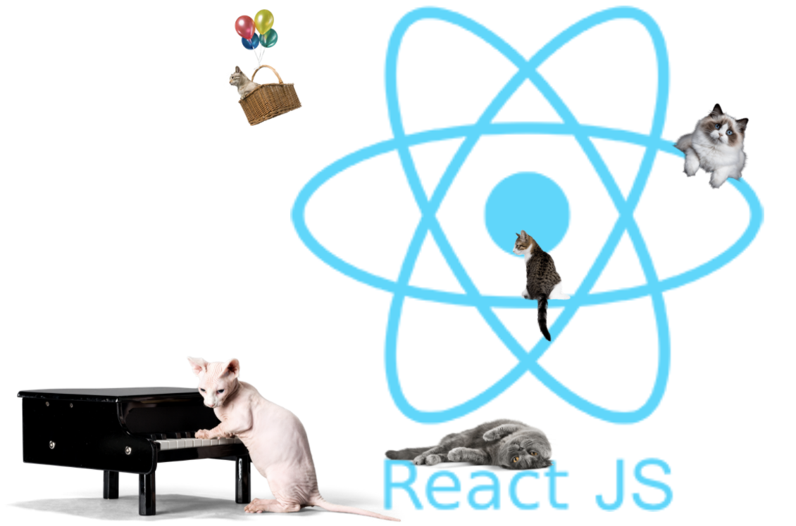

# React Props and State

Welcome back to the wonderful world of React Part 2! This time we'll be investigating React Props and States. Let's get started 🙌



## How to Get Started

Fork this repo to your Github and then clone the forked version of this repo

To install the dependencies run:

### `yarn install`

or

### `npm install`

(They both do the same thing)

Make sure you're in the right directory!

To start the app:

### `yarn start`

or

### `npm start`

Runs the app in the development mode.

The app should open in your browser and you should recognize some beautiful cat cards!

If the page doesn't open automatically, you can open [http://localhost:3000](http://localhost:3000) to view it in the browser.

The page will reload if you make edits 👍

You will also see any lint errors in the console ✅

Meow, lets get started! 😺

## File System ~~Overmew~~ Overview 

This project was created with `npx create-react-app`. This command (followed by the name of your project) builds a React App for you and was used to create this project which we then modified. Neat!

If you are unfamiliar with the Create React App file structure, you can find a break down in [Activity 1](./activities/activity-1.md) 🔨 

Feel free to skip ahead to What is React? if you're happy with what file does what!

# What is React? 🧐

React is a JavaScript library for building interactive User Interfaces 📚

# What is a Component? 🧱

A Component is one of the core building blocks of React. Components are independent and reusable bits of code. 

Every application you will develop in React will be made up of pieces called components. To put it simply, React components are functions that return pieces of JSX (HTML with the power of JavaScript!). These pieces tell the browser what should be rendered on the screen.

An example component might look like this:

```
function Button () {
    return (
        <button>Success!</button>
    )
}

export default Button;
```

- Note how the component function name "Button" has a capital "B". Components must have capital letters otherwise they get mistaken for built-in components (capitalized names refer to custom components)

- Depending on your version of React you might have to add `import React from 'react'` at the top of the button file too

- If we were returning more than one element we would need to wrap our component in a `<div></div>` or [fragment](https://reactjs.org/docs/fragments.html) `<></>`

- Notice how we export our Button at the end. This is so we can import our component and use it elsewhere in our application

- Components can refer to other components in their output. So if we wanted to, our button could import another Button component, or a Header component - or anything we like! 

If we wanted to use our Button component in our `App.js` file we could import it to `App.js` and render it like this:

```
import './App.css';
import Button from './components/button' // <----- here we import our button

function App() {
  return (
    <>
        <Button/> // <----- this is how we render our button 
    </>
  );
}

export default App;
```

- Notice how we import our Button at the top of our file then return it as if it were an HTML element 

Now you know what a React Component is - you're ready to go-go!

See [Activity 2](./activities/activity-2.md) for your first challenge


