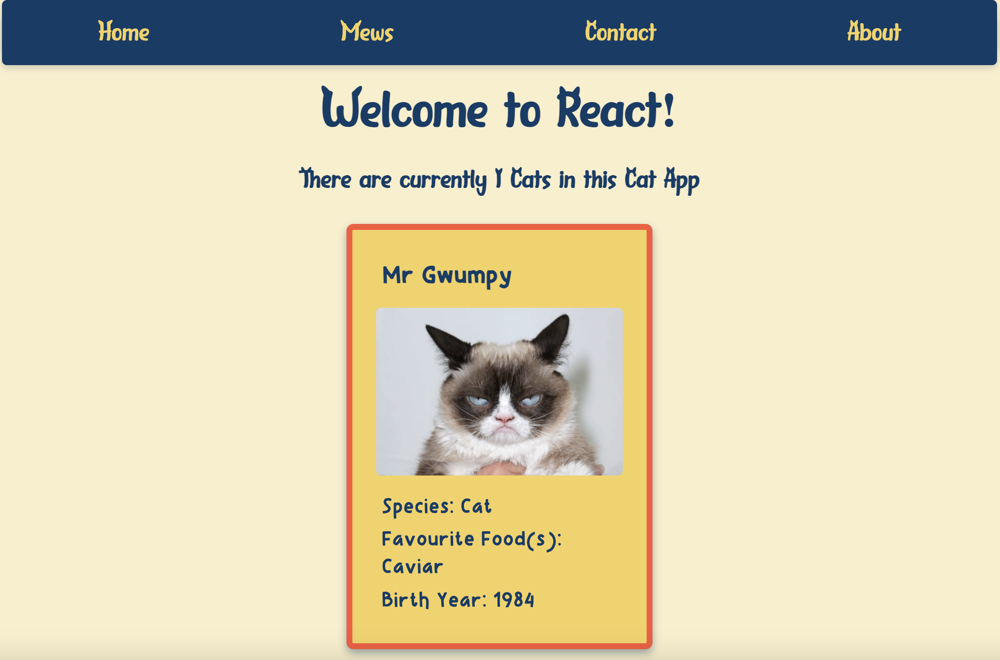

# Activity 3 - Render a Cat Card

Ok! So!

We've imported our cat Data.

We've created an all seeing, all powerful cat card (well, soon to be!)

First let's render our cat card on the screen.

## Step 1

In the return statement, under `
` in your App function, render your cat card.

Click here to see the answer

<pre>

`<CatCard />`
</pre>

Your app should look something like this:

Click here to see the answer

<pre>

</pre>

That's one grumpy pussy cat.

## Step 2

Ok so we've got one grumpy kitty showing, but that's not much good. We want to show *all* the cats from our cat data on the screen in all their cat glory!

How do we do that? 🤔

Well, our cat data is in an Array, right?

And we know if we want to access each item in an array we can use some kind of....

Click here to see the answer

<pre>

for Loop!

Just like we'd loop through a normal array lets loop through our Cat data! 😺 ↬

</pre>

Ready for more? [Activity 4](./activity-4.md)!
