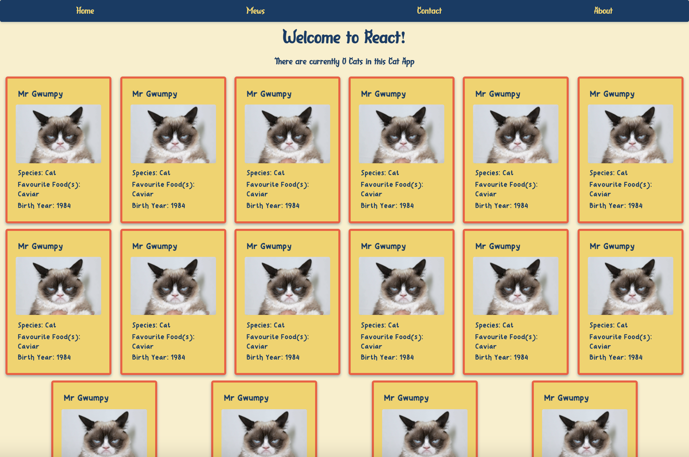

# Activity 4 - Loop de loop!

In `App.js` create a loop to render your Cat Card with

Hint: An ES6 looping method might be a little easier than a traditional forLoop
Hint: To insert JavaScript into our HTML or 'JSX' you'll need to write your JavaScript code inside a pair of curly braces { }.

<details>
<summary>Click here to see the answer</summary>
<pre>

```
    {cats.map(cat => {
    return (
        <CatCard />
    )
    })}
```

Ok let's break it down. 🔨

- We first told React we were going to insert some JavaScript into our `App.js` return statement by writing a pair of curly bois (braces)

- We took our cat data and used the `.map()` method to loop through our cat objects

- For every cat object in our cat data array, we return a `<CatCard />`

- Neat 👍

Your App should look something like this:



P.s. don't forget to delete your original `<CatCard />` if you haven't already!

</pre>
</details>

Time to jive in [Activity 5](./activity-5.md) 💃🕺
